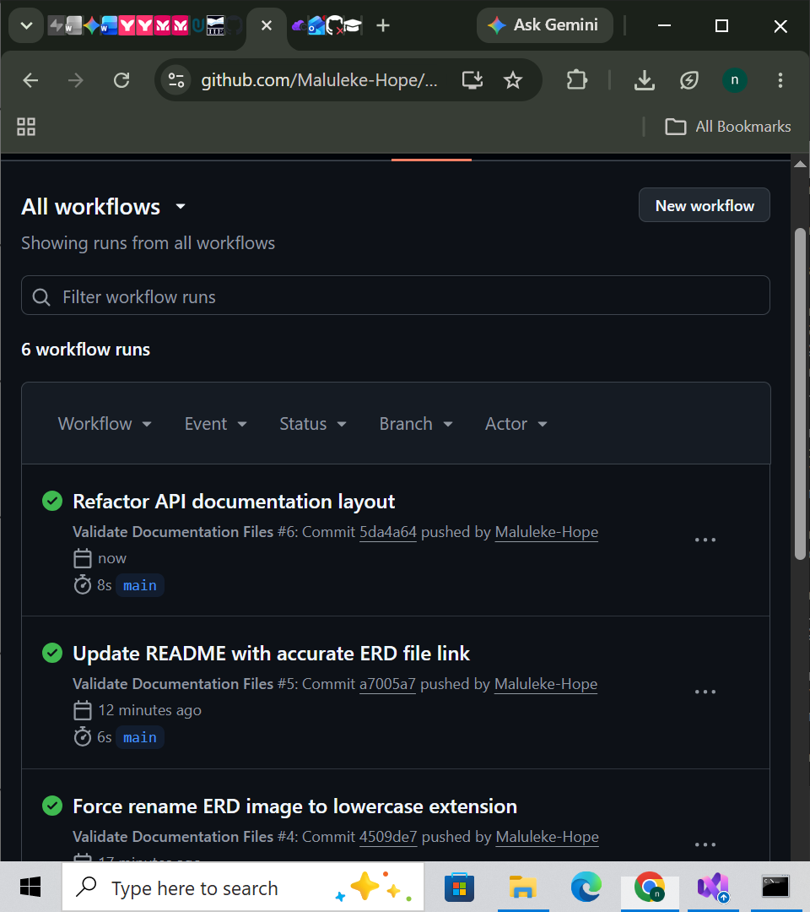

# RaceDay - Event Management System (PROG6212 POE Part 1)

Overview
RaceDay is a full-stack database-driven system designed for managing South African road running, walking, and cycling events.

System Roles
- Organiser: Creates and manages events, sets up distance categories, and logs participant finish results.
- Participant: Registers for available events, receives designated bib numbers, and views historical performance.

Included Documentation
- `/docs/RaceDay_ERD.png` : ERD detailing entities, primary/foreign keys, and cardinalities.
- `/docs/API_Endpoint_Plan.md` : Complete RESTful API specification table including routes, HTTP methods, roles, payloads, and response status codes.
- `/docs/RaceDay_Database.sql` : Production T-SQL database creation script with table constraints, foreign key cascades, and seed data.
- `/docs/CI_Pass_Screenshot.png` : Verification screenshot of the passing GitHub Actions CI pipeline.

Automated Testing & CI Status

Demonstration Video

https://youtu.be/PNqA6RTLNG8

AI Assistance & Prompt Declaration

In accordance with academic integrity guidelines, Generative AI (Gemini / ChatGPT) was used strictly as an peer assistant and debugging tool during the development of Part 1. 

Scope of AI Usage
AI was used for:
1. Syntax troubleshooting during T-SQL script execution in SSMS.
2. Formatting and structuring the RESTful API Endpoint Plan table in Markdown.
3. Reviewing documentation against the assessment rubric for completeness.

All underlying database schema designs, primary/foreign key relationships, business logic rules, repository configurations, and presentation video demonstrations were designed, implemented, and verified independently.

### Representative Prompts Used
Below are examples of the specific prompts issued during development:

Database Script Debugging:
 
 >I am getting 'Msg 208: Invalid object name' when running my T-SQL script in SSMS. How do I ensure my script automatically creates and targets the correct database instance before building tables?

PI Documentation Alignment:

  > How should I structure a RESTful API endpoint specification table in Markdown to clearly map HTTP verbs, routes, request bodies, and standard HTTP response status codes for an ASP.NET Core Web API?

Rubric & Quality Check:

  > What are the standard technical documentation requirements for an ERD, API plan, and database script for a C# and SQL event management system submission?